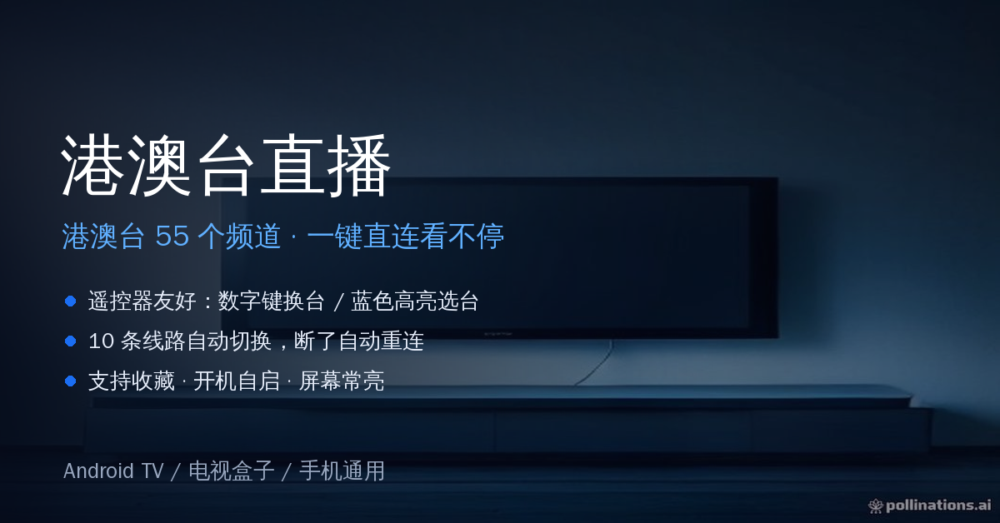

<div align="center">
  
  <h1>港澳台直播 · Android TV</h1>
  <p><b>港澳台 55 个频道，装上就能看，遥控器一点就换台</b></p>
  <p>
    <a href="https://github.com/personal82555/gangao-tv/releases/latest"></a>
    
    
  </p>
</div>

---

## ✨ 为什么值得装

| | 特点 | 说明 |
|---|---|---|
| 📺 | **55 个港澳台频道** | 香港 / 澳门 / 台湾 三大分组，含 TVB 翡翠台、明珠台、无线新闻、凤凰卫视、ViuTV、HOY TV、澳视、台湾综合台等 |
| 🎮 | **遥控器真的能用** | 数字键直接跳台；选台面板方向键移动，**选中行蓝底高亮**，按 OK 播放 |
| 🔀 | **10 条线路自动切换** | 一条不通自动换下一条，不用手动折腾 |
| 🔁 | **断了会自己回来** | 网络抖动自动重试；从后台/设置页返回自动重连画面；实在不行点「▶ 继续播放」 |
| ⭐ | **收藏常看频道** | 菜单键一键收藏，收藏分组置顶 |
| 🚀 | **秒开体验** | 高亮频道时后台悄悄备好源，按 OK 基本秒开；看过的频道切回是瞬间的 |
| 💡 | **贴心的电视细节** | 开机自启动、播放中屏幕常亮、连滑两次安全退出（带确认）、全屏无干扰 |
| 🆓 | **免费可用** | 每天免费 1 小时；需要长时间观看可购买月卡/季卡/永久 |

## 📺 频道分组

| 分组 | 数量 | 代表频道 |
|---|---|---|
| 🌏 香港 | 20+ | TVB 翡翠台、TVB Plus、明珠台、无线新闻台、凤凰卫视中文台/资讯台、ViuTV、HOY TV、港台电视 31 |
| 🌏 澳门 | 6 | 澳视澳门、澳视综艺、澳视资讯、澳门莲花、澳門卫视 |
| 🌏 台湾 | 20+ | 台视、中视、华视、民视、公视、TVBS、东森、三立、八大、龙华系列 |

> 频道数量与线路由源站动态提供，实际以 App 内列表为准。

## 🎮 遥控器操作

| 按键 | 作用 |
|---|---|
| **OK**（画面中） | 弹出选台面板 |
| **上下** | 移动选中项（蓝底高亮），停一下会自动预加载 |
| **左右** | 在「分组 ↔ 频道」之间切换 |
| **OK**（面板中） | 播放选中的频道 |
| **返回** | 收起面板 |
| **数字键** | 直接跳到对应频道号 |
| **菜单键** | 收藏 / 取消收藏当前频道 |
| **连滑两次** | 退出应用（有确认弹窗） |

## 📥 下载安装

1. 下载最新 APK：[**港澳台直播-v9.2.0.apk**](apk/港澳台直播-v9.2.0.apk)（或到 [Releases](../../releases) 下载）
2. 传到电视盒子 / 电视 / 手机上
3. 安装时允许「未知来源」应用
4. 打开即播，默认进入 **TVB 翡翠台**

- 包名：`com.iptv807.tv` ｜ 支持 Android 5.0 及以上 ｜ 横屏
- TV 桌面会自动出现横幅图标（Leanback）

## 💳 会员与激活

- **免费**：未激活也能看，每天 1 小时
- **扫码购买**：设置 →「支付成为会员」→ 选套餐 → 支付宝/微信扫码 → **支付成功自动激活本机**（无需卡密）
- **卡密激活**：设置 →「卡密激活」→ 输入卡密 → 立即生效（无需重启）

## 🛠 技术栈

```
Kotlin · Android Media3 / ExoPlayer · Leanback 兼容 · 无第三方 SDK
```

- 播放源在 App 内实时解析（Referer / 302 跟随 / FLV 直播流），不依赖任何中转服务
- 三级缓存（内存 / 磁盘）+ 每频道独立锁，网络抖动不影响切台
- 播放中断自动换线路、缓存 token 过期自动刷新源

## ❓ 常见问题

**Q：某些频道要等几秒才出来？**
A：源站每次取流需要现拉一次页面，偶尔较慢；已经打开过的频道会缓存 30 分钟，切回去是瞬间的。

**Q：显示「全部线路失败」？**
A：多为该频道源站临时故障或网络抖动，App 会自动重试并刷新源；稍后再试或换一个频道。

**Q：从设置页返回画面不动了？**
A：已自动重连；若仍不动，屏幕中央点「▶ 继续播放」（遥控 OK 也可以）。

## ⚠️ 免责声明

- 本项目仅是一个**播放器外壳**，不存储、不转播、不托管任何视频内容。
- 所有频道数据均来自第三方公开网站，版权归原方所有。
- 本项目仅供个人学习与技术交流，请勿用于商业用途；请于下载后 24 小时内自行删除。
- 若相关内容侵犯了您的权益，请提交 Issue，我们会及时处理。

## 📄 更新日志

见 [CHANGELOG.md](CHANGELOG.md)

## 📜 许可

[MIT](LICENSE)
